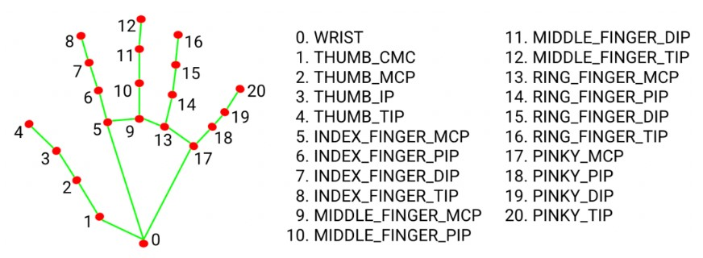
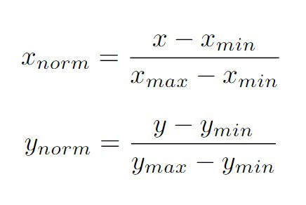

# Introduction to Computational Robotics: Computer Vision Project

Authors: [Dexter Friis-Hecht](https://github.com/dfriishecht) & Mo Ampane

## Project Overview

The goal of this project was to use computer vision (CV) to recognize various hand gestures to control a finite state machine using ROS2 in Python. Through the use of opencv and implementation of a hand gesture classifier, we aimed to gain practical experience with CV and machine learning (ML) models. The goal of creating the finite state machine and corresponding robot behaviors was to reinforce our Python and ROS2 skills.

The project can be broadly broken down into hand recognition, gesture recognition, and finite state machine implementation.

## External Libraries

To recognize a single hand, we used Google's ML library [MediaPipe](https://developers.google.com/mediapipe). For real time CV we used OpenCV's Python library. We made use of [computervisioneng](https://github.com/computervisioneng)'s [collect_imgs.py](https://github.com/computervisioneng/sign-language-detector-python/blob/master/collect_imgs.py) to make our classifier's training dataset. Finally, we used sci-kit learn to make our classifier.

## Data Collection and Processing

MediaPipe's hand recognition algorithm represents a hand as 21 hand-knuckle $(x,y,z)$ coordinates in the image frame. Training the hand gesture classifier required creating a dataset of coordinates for each gesture.

|                                                                  |
| :-----------------------------------------------------------------------------------------------------------------------: |
| _Fig 1. Diagram of a [MediaPipe](https://developers.google.com/mediapipe/solutions/vision/hand_landmarker) hand landmark_ |

Using collect.py we took 200 pictures of each gesture and saved the $(x,y)$ hand-knuckle coordinates of the recognized hand. To make our classifier position agnostic, we normalized the coordinates.

|                                                                                                    |
| :----------------------------------------------------------------------------------------------------------------------------------------------------------------: |
| _Fig 2. Gif of raw hand mesh (red) and normalized hand mesh (blue), normalized hand mesh values are from 0-1 but to be visible for the figure they are from 0-100_ |

|  |
| :-------------------------------------------------------: |
|              _Fig 3. Normalization equation_              |

## The Classifier and Real Time Gesture Recognition

After collecting training data we had to decide what ML model would work best for this classification. We tried sci-kit learn's built in 'RandomForestClassifier()', 'MLPClassifier()', and 'KNeighborsClassifier()'. Using the 'MLPClassifier()' worked best for our application. The neural network we made had 3 hidden layers of size 100, 50, and 10, and went through 15 epochs. The k-nearest neighbors classifier used 10 nearest neighbors and appeared to always be 100% confident in its classification so it did not recognize the no gesture state well. We believe the neural network worked best because of our large training dataset, 200 data points per gesture or 1800 data points.

For classifying a gesture in real time, one hand is recognized, the $(x,y)$ hand-knuckle coordinates are normalized, and a classification is made from the normalized data. There are 9 unique hand gesture classifications and the classifier recognizes when a gesture is not being made when it's less than 60% confident in it's prediction. To communicate what the robot is understanding, a label is shown above the user's hand indicating what the classifier predicts their gesture to be and how confident it is in it's prediction.

|  |
| :------------------------------------------------------: |
|    _Fig 4. Gif of Gesture and no gesture recognition_    |

## ROS2 Integration

Image message to opencv image

## Behavior Implementation

Add gifs of behaviors

## Challenges

Location of camera, range of hand detection from camera...

## Stretch Goals

## Learnings
